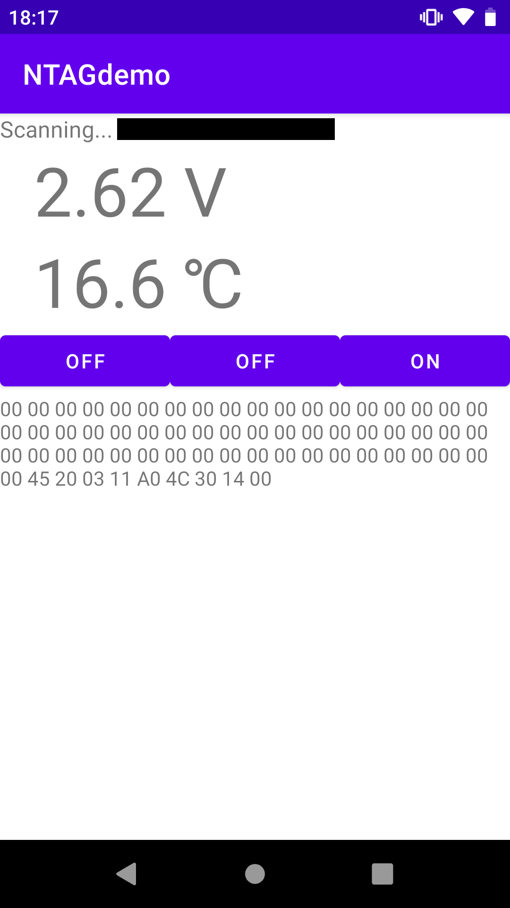

# NTAGdemo

[NTAG I2C plus Explorer Kit](https://www.nxp.jp/products/rfid-nfc/nfc-hf/connected-nfc-tags/ntag-ic-iplus-i-explorer-kit:OM5569-NT322E)用のAndroidアプリです。

## 概要

以下の情報を取得表示します。

- 電圧
- 温度
- スイッチ×3

## 画面

